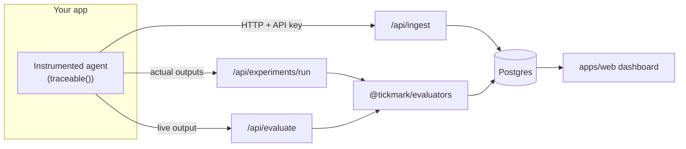

# Tickmark

**Every AI answer gets its tickmark.**

Tickmark is an open-source evaluation, observability, and governance platform for multi-agent GenAI
systems in regulated finance — built as a focused, finance-vertical alternative to general-purpose tools
like LangSmith.

An auditor's *tickmark* is the small mark made once a figure has been traced back to its source
document. That's the whole idea: every number, citation, and claim a finance agent produces should be
traceable, verifiable, and reviewable — not just logged.

## Why not just use LangSmith?

LangSmith (and tools like it) give you tracing, datasets, experiments, and LLM-as-judge evaluation. Those
are necessary but generic. None of them know that a hallucinated revenue figure, an uncited claim, or a
disclosure of Material Non-Public Information is a *different class of failure* than a badly-formatted
JSON response. Tickmark bakes finance-specific checks and audit-grade governance into the platform
itself.

| Capability | LangSmith | Tickmark |
|---|---|---|
| Tracing, datasets, experiments, LLM-as-judge | ✅ | ✅ |
| Multi-agent / tool call-graph visualization | partial | ✅ first-class DAG view |
| Finance-specific evaluator pack (numeric grounding, citation verification, PII/MNPI leakage, disclaimer checks) | ❌ | ✅ built in |
| Tamper-evident, hash-chained audit log | ❌ | ✅ |
| Human review queues with reviewer verdicts | partial | ✅ |
| Self-hostable OSS core | paid/enterprise tier | ✅ MIT-licensed |

## Features

- **Tracing SDK** (`@tickmark/sdk`) — wrap any async function with `traceable()` and nested calls are
  automatically linked into a trace, via `AsyncLocalStorage`. No manual span plumbing.
- **Finance evaluator pack** (`@tickmark/evaluators`) — numeric grounding (catches hallucinated figures
  against a source document), citation grounding (catches fabricated or missing citations), PII/MNPI
  leakage detection, and compliance disclaimer checks, alongside the usual exact-match, numeric-tolerance,
  JSON-schema, and LLM-as-judge evaluators.
- **Multi-agent call graph** — every trace renders as both a waterfall (like a typical tracing tool) and
  a DAG of agent → tool → agent calls, so you can actually see the shape of a multi-agent system.
- **Experiments** — run the evaluator pack against a dataset and see pass/fail per example, per
  evaluator.
- **Human review queue** — flag, approve, or reject any trace; every verdict is appended to the audit
  log.
- **Monitoring dashboard** — quality (evaluator pass rate), latency, and cost over time, with a
  threshold alert banner.
- **Hash-chained audit log** — every ingested trace, evaluation, and human review is appended to a
  tamper-evident log (`packages/db/src/audit.ts`). Exportable as CSV/JSON with chain verification.

## Architecture



- `packages/sdk` — the tracing SDK your app depends on.
- `packages/evaluators` — the evaluator interface + built-in pack; pure functions, unit-testable in
  isolation, no DB or network dependency.
- `packages/db` — Drizzle schema, migrations, and the audit hash-chain logic.
- `apps/web` — Next.js dashboard + API routes (ingestion, evaluation, experiments, audit export).
- `apps/demo-agent` — a small instrumented "finance research agent" (mock SEC-filing lookup + calculator
  tools) with a seeded finance-QA dataset, so the dashboard is populated out of the box.

The platform **evaluates and records — it doesn't execute your agent for you.** Your instrumented app
calls its own logic, then POSTs the actual output to `/api/experiments/run` or `/api/evaluate`. This
keeps the server from ever executing arbitrary user code.

## Quickstart

```bash
pnpm install
cp .env.example .env
# set DATABASE_URL to a local/hosted Postgres 15+ (Supabase works well)

pnpm db:migrate     # apply the schema
pnpm db:seed        # seeds a demo org/project/API key + finance QA dataset
pnpm dev            # starts the dashboard on http://localhost:3000

# in another terminal
pnpm demo           # runs the instrumented finance agent, populates traces + an experiment
```

Open `http://localhost:3000/traces`. No Supabase auth setup is required to try it — see **Demo mode**
below.

### Demo mode

`apps/web` runs against the first project in the database when `NEXT_PUBLIC_SUPABASE_URL` isn't set, so
the dashboard is browsable without configuring auth. Set `NEXT_PUBLIC_SUPABASE_URL` /
`NEXT_PUBLIC_SUPABASE_ANON_KEY` / `SUPABASE_SERVICE_ROLE_KEY` (see `.env.example`) to enable real
multi-tenant auth — the dashboard layout then scopes every page to the signed-in user's org/project via
`packages/db`'s `orgMembers` table.

### Using the evaluator pack yourself

```ts
import { runEvaluators } from "@tickmark/evaluators";

const results = await runEvaluators(
  ["numeric-grounding", "citation-grounding", "pii-mnpi-leakage", "disclaimer-presence"],
  {
    input: "What was Q3 revenue?",
    actualOutput: "Q3 revenue was $128.4 million [S1].",
    metadata: {
      sourceDocument: "...Q3 net revenue was $128.4 million...",
      sources: [{ id: "S1", text: "10-Q filing excerpt" }],
    },
  },
);
```

### Instrumenting your own agent

```ts
import { traceable } from "@tickmark/sdk";

const lookupFiling = traceable(async (ticker: string) => { /* ... */ }, {
  name: "sec-filing-lookup",
  type: "tool",
});

const agent = traceable(async (question: string) => {
  const filing = await lookupFiling("ACME"); // becomes a child span automatically
  return answerFrom(filing, question);
}, { name: "finance-research-agent", type: "agent" });
```

Set `TICKMARK_INGEST_URL` and `TICKMARK_API_KEY` (issued from **Settings** in the dashboard, or by
`pnpm db:seed`) and every call is traced.

## Enterprise roadmap

Deliberately out of scope for this OSS core, tracked here rather than half-built:

- SSO/SAML and fine-grained RBAC
- ML-based quality/drift detection (the monitoring dashboard currently uses a simple threshold alert)
- Alerting integrations (Slack/PagerDuty/webhooks)
- Horizontally-scaled ingestion (queue-backed instead of direct insert)
- SOC 2 tooling and formal compliance attestations
- Billing / usage-based metering

## Development

```bash
pnpm turbo run lint typecheck test   # before opening a PR
```

See [CONTRIBUTING.md](./CONTRIBUTING.md).

## License

MIT — see [LICENSE](./LICENSE).
